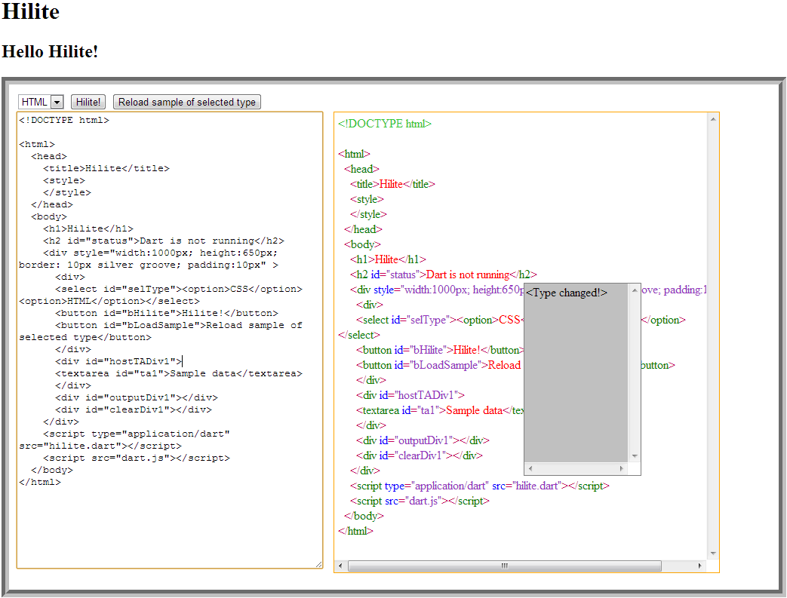

Hilite Tutorial
===============

Welcome to the Hilite Tutorial.

The tutorial serves as a [sample of Dart](https://github.com/jpedrosa/reluzir/blob/master/learn_dart_in_15_minutes/learn_dart_in_15_minutes.dart), while also introducing the [Lexer library](https://github.com/jpedrosa/reluzir/tree/master/lexer) I've been working on.

Dart is a language for the browser, just like JavaScript. Dart brings a lot of new features that are meant to come to JavaScript at some point through the ECMAScript standardization efforts.

The Lexer I've created with Dart does highlighting of [HTML](https://github.com/jpedrosa/reluzir/blob/master/lexer/lib/html.dart) and [CSS](https://github.com/jpedrosa/reluzir/blob/master/lexer/lib/css.dart). Both of which are used in this tutorial.


hilite.html
-----------

This file holds the HTML part of the application. At a minimum it points the browser towards the needed files. A Dart application could use very little or lots of HTML. Some of the core Dart libraries like Web UI and the one that supersedes it called Polymer start from the standpoint that we need HTML templating to succeed. Although some new features of the browser like Canvas and WebGL can work without a lot of HTML. And the DOM could also be programmed without a lot of static HTML if we instead created elements at runtime.

The HTML file has two lines that are important to start it all:

```html
<script type="application/dart" src="hilite.dart"></script>
<script src="dart.js"></script>
```

The first one points to the Dart file that's the entry point to our application. That file needs a main() { } method, which is in fact the entry point.

The second line loads some Dart utility in JavaScript that does some preparation before it can load the Dart file of the first line. The preparation could be to choose whether to load the Dart file or a translated JavaScript file. Because Dart can be translated to JavaScript to work on any existing browser, without the need for a Dart native support.


The very first line of the HTML is also important:

```dart
<!DOCTYPE html>
```

Setting the correct Doctype ensures that Dart can work at all with the given browser. Because Dart is meant for modern browsers with modern features, and setting the Doctype tells the browser that yes, we want the good new things so the browser can leave the legacy behind.

That Doctype is the simplified one of HTML5.

[The remainder of the HTML](https://github.com/jpedrosa/reluzir/blob/master/lexer/tutorial/hilite.html) is not very noteworthy. I used the HTML to drive the application in a more declarative way, approaching what one would do with Polymer. But Polymer is still in development, and I don't have any experience with it yet to be honest.

hilite.dart
-----------

This file is the actual Dart file. It could also be a packaged file if we had used one of the Dart compilers to package it up. Creating a deployment package with Dart is very cool. It brings all the dependencies into a single file, while also removing a lot of the code that the program doesn't use, but just exists in the libraries that the program has access to.

With all of the dependencies being put into a single file, loading the Dart application is faster!

The command to use to package Dart up for deployment is the Dart2JS utility. It has several options. It even does minification.

The first lines of [hilite.dart](https://github.com/jpedrosa/reluzir/blob/master/lexer/tutorial/hilite.dart) are for library imports:

```dart
import 'dart:html' as DH; // Give a wrapping name to the imported library.
import "../lib/html.dart"; // HtmlLexer
import "../lib/css.dart"; // CssLexer
import "../../codeunitstream/lib/codeunitstream.dart"; // CodeUnitStream
```

Libraries in Dart have their own scope and can be imported with added flexibility. We can give imported libraries custom names that avoid conflicts with other code. It's also possible to export the available library as an API instead.

I favor giving abbreviated names to libraries from others that I import. That ensures that I can control the scope a little better. With little wrappers we can make working with libraries from others a bit more convenient too! Just like in hilite when I did this:

```dart
  // Shortcut for retrieving elements based on id.
  el(s) => DH.query("#${s}");
  
  // Prepare the input events.
  prepareInput() {
    // Events generally include one parameter which we need to
    // specify even if we just ignore it.
    sel = el(idSel);
    sel.onChange.listen((ev) => noticeTypeChange());
    el(idHiliteButton).onClick.listen((ev) => hilite());
    el(idLoadSampleButton).onClick.listen((ev) => loadSample());
    ta = el(idTa);
    outDiv = el(idOutputDiv);
  }
```

Dart is much more succinct than most languages when we aren't declaring too many types in Dart. Dart was built under a lot of constraints of having to work in the browser alongside JavaScript and so on. Even then, Dart was able to do away with redundancies found in JavaScript.

Such as, in JavaScript we read a lot of "function" for function declarations. Maybe a lot of "prototype" too. And a lot of "typeof". Even a lot of comparisons with the triad "===". And a lot of "this", "bind" and maybe "that."

In Dart, a lot of that is not needed. Functions are declared without the needed "function" of JavaScript. Just "(argument1, argument2) { }" will do. Nesting functions makes JavaScript appear more verbose, whereas Dart is just OK.

In Dart, class and methods don't need explicit "prototype" manufacturing. Just "class Sweet { sugar() {} }" and in Dart you have a class named Sweet with a method named sugar.

In Dart we have "is" for comparing types. Want to know if a type is String? That reads like English: "o is String"

In Dart comparisons with "==" are standard. In JavaScript implicit conversions make working with "==" less certain. In Dart it's OK.

And in Dart events and functions and methods are correctly bound based on our expectations. No need for more verbosity of JavaScript there, either.

All of that while keeping the spirit of JavaScript alive with "untyped" or late binding still being the default. Which is why I like Dart. Prototyping as fast development, like writing this tutorial, is quite OK!

JavaScript is promised to get getters like this:

```dart
  // The way to write a side-effect free getter.
  get isCssSelected => sel.value == 'CSS'; 
```

In fact, Dart borrowed some of that syntax from the ECMAScript that JavaScript is also tracking in future versions. So a huge thanks to the folks who came up with those handy syntax. I like it!

Dart already includes the "map" method that we find in Ruby and in some JavaScript libraries:

```dart
    // In one swoop get the sample data from the TextArea element,
    // split it into lines, pass each line to the lexer to
    // transform into tokens. From the tokens make span elements
    // which with their style class feature should paint the tokens
    // into the configurable colors set in the style of the hilite HTML.
    outDiv.innerHtml = ta.value.split("\n").map((line) {
      var sb = new StringBuffer(); // Some efficient string concatenation.
      stream.text = line; // Load line into CodeUnitStream.
      lexer.parse(stream, status, (tt) { // Give the lexer some work.
        // String interpolation makes this more succinct.
        sb.write('<span class="${prefix}${colorClass(tt)}">');
        // Escape some special HTML characters.
        sb.write(escapeHtml(stream.currentTokenString));
        sb.write('</span>');
      });
      // map iterates the lines replacing them with the returned content.
      return sb.toString(); // OK. Join the StringBuffer into a string.
    }).join("<br/>"); // Add HTML lines in place of the newlines.
```

In this code I used StringBuffer. But I could have used a simple array instead and done the joining on it just like people do in JavaScript. I just don't know which one is preferred.

Check the [remainder of the hilite.dart code.](https://github.com/jpedrosa/reluzir/blob/master/lexer/tutorial/hilite.dart)

For more on Dart, be sure to check its thorough website: http://www.dartlang.org/
The Dart site includes API references, Editor download and much more.

An alternative is the [Learn Dart in 15 minutes tutorial.](https://github.com/jpedrosa/reluzir/blob/master/learn_dart_in_15_minutes/learn_dart_in_15_minutes.dart))

You can see a screenshot of the Hilite application:



And you can run it instead by clicking here: http://jpedrosa.github.io/reluzir/hilite_tutorial/index.html


I think Dart is due a bright future. Some web application programming with Canvas, WebGL and so on is still being discovered. But when coupled with the unique features of Dart like its ease of deployment, it could make a lot of sense. Meanwhile, JavaScript is also here to stay. Maybe the two of them could be coupled both on the client and on the server. Two is always better than one, right? :-)

Thanks for reading.

Cheers,
Joao


